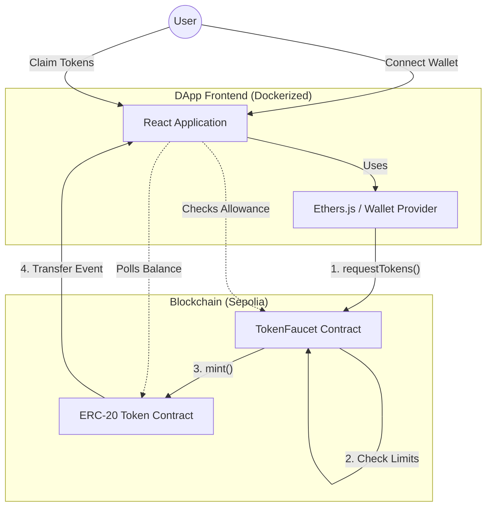
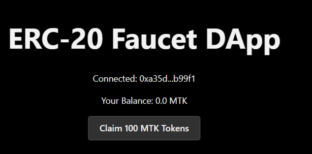
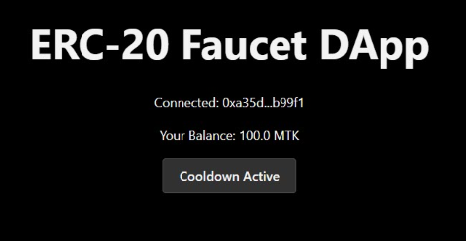
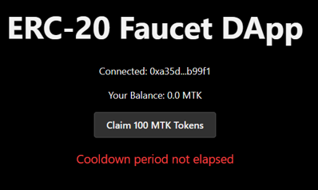
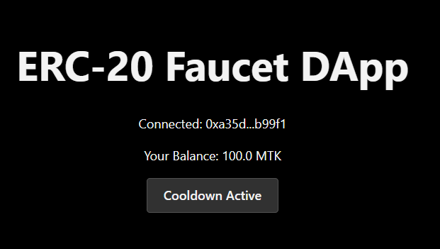

ERC-20 Token Faucet DApp (Sepolia)

A full-stack decentralized application (DApp) that implements an ERC-20 token faucet with enforced rate limits, wallet integration, and Dockerized deployment.
The faucet allows users to claim a fixed amount of tokens with a 24-hour cooldown and a lifetime claim limit, fully enforced on-chain.

FEATURES
- ERC-20 compliant token with fixed maximum supply
- 24-hour cooldown per address
- Lifetime claim limit per address
- Admin-controlled pause/unpause
- MetaMask wallet integration
- Real-time token balance updates
- User-friendly error handling
- Deterministic evaluation interface (window.__EVAL__)
- Fully Dockerized frontend with health checks

## ARCHITECTURE DIAGRAM

DEPLOYED CONTRACTS (SEPOLIA)
ERC-20 Token:
0x10a619Ca52C84Af1F1F48733594311a71F9c8497
https://sepolia.etherscan.io/address/0x10a619Ca52C84Af1F1F48733594311a71F9c8497

Token Faucet:
0xf5da04643556eb8642e81DD2034afe54449D10C5
https://sepolia.etherscan.io/address/0xf5da04643556eb8642e81DD2034afe54449D10C5

EVALUATION INTERFACE
The frontend exposes a global evaluation object:

window.__EVAL__
- connectWallet()
- requestTokens()
- getBalance(address)
- canClaim(address)
- getRemainingAllowance(address)
- getContractAddresses()

All numeric values are returned as strings.

RUN LOCALLY WITH DOCKER
1. Clone repository
2. Copy environment file
3. Run Docker

Commands:
git clone <https://github.com/thirupathireddy27/erc20-faucet-dapp.git>
cd erc20-faucet-dapp
cp .env.example .env
docker compose up --build

Access:
http://localhost:3000
Health:
http://localhost:3000/health

ENVIRONMENT VARIABLES
VITE_RPC_URL=https://sepolia.infura.io/v3/YOUR_INFURA_KEY
VITE_TOKEN_ADDRESS=0xYourTokenAddress
VITE_FAUCET_ADDRESS=0xYourFaucetAddress

SECURITY CONSIDERATIONS
- Solidity ^0.8.x overflow protection
- Only faucet can mint tokens
- Admin-only pause functionality
- Checks-effects-interactions pattern
- Clear revert messages

DESIGN DECISIONS
- Fixed faucet amount for predictable UX
- 24-hour cooldown to prevent abuse
- Lifetime cap for fair distribution
- Fully on-chain enforcement

SCREENSHOTS
Screenshots are available in the `screenshots/` directory:

### Wallet Connected / App Loaded

### Successful Claim

### Cooldown Error

### Claim Disabled

### Health Endpoint

STATUS
All core requirements satisfied:
- Contracts deployed and verified
- Frontend fully functional
- Docker deployment verified
- Evaluation interface operational